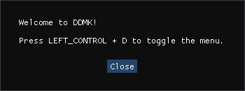

# DDMK

The compilation of my work on the Devil May Cry PC games. It contains various extensive gameplay mods, tools, fixes and training utilities. It also adds multiplayer capabilities to select entries.

See [Features](https://github.com/serpentiem/ddmk/wiki/Features) for a more detailed overview.


# Installation

Releases may vary. Names, directories and files could all be different. However, unless special instructions are given, your job is always the same: You just copy a bunch of stuff to the game's root directory.

Be sure to [create backups of your savegames](#create-savegame-backups)!

* Download and extract the [latest release](https://github.com/serpentiem/ddmk/releases).

    The latest stable release is labelled `Latest`, while releases with experimental features are usually labelled `alpha`, `beta`, `nightly` or `Pre-release`.

    The archive you need to download can be found under `Assets` at the end of the release post. Its name usually starts with `ddmk` and ends with `.zip`.

## Devil May Cry HD Collection

* Copy the contents of `HDC` to the Devil May Cry HD Collection root directory. By default this is `C:\Program Files (x86)\Steam\steamapps\common\Devil May Cry HD Collection`. If asked to replace, confirm all.

The following is required to undo the latest patch. You only need to do this once and not every time you update the mod.

* Download the following archives and extract the specified files to the Devil May Cry HD Collection root directory.

    | Archive                                                                                                    | File                      |
    | ---                                                                                                        | ---                       |
    | [xdelta3](https://www.romhacking.net/download/utilities/928/)                                              | xdelta3-3.0.11-x86_64.exe |
    | [hdc_patches](https://github.com/serpentiem/ddmk/releases/download/2.7.3release/hdc_patches.zip)           | All Files                 |

* Run `apply_patch.bat`.

The following is required for Devil May Cry 3 if you want to use Quick Drive. You only need to do this once and not every time you update the mod.

* After installing the mod, run Devil May Cry 3 at least once so the cache files are created.

* Download the following archives and extract the specified files to `C:\Program Files (x86)\Steam\steamapps\common\Devil May Cry HD Collection\data\dmc3\GData.afs`.

    | Archive                                                                                                    | File                      |
    | ---                                                                                                        | ---                       |
    | [xdelta3](https://www.romhacking.net/download/utilities/928/)                                              | xdelta3-3.0.11-x86_64.exe |
    | [dmc3_quick_drive](https://github.com/serpentiem/ddmk/releases/download/2.7nightly16/dmc3_quick_drive.zip) | All Files                 |

* Run `apply_patch.bat`.

## Devil May Cry 4

* Copy the contents of `4` to the Devil May Cry 4 root directory. By default this is `C:\Program Files (x86)\Steam\steamapps\common\Special Edition`. If asked to replace, confirm all.

The following is required to undo the latest patch. You only need to do this once and not every time you update the mod.

* Download the following archives and extract the specified files to the Devil May Cry 4 root directory.

    | Archive                                                                                                    | File                      |
    | ---                                                                                                        | ---                       |
    | [xdelta3](https://www.romhacking.net/download/utilities/928/)                                              | xdelta3-3.0.11-x86_64.exe |
    | [4_patches](https://github.com/serpentiem/ddmk/releases/download/2.7.3release/4_patches.zip)               | All Files                 |

* Run `apply_patch.bat`.


If you've installed the mod successfully, you'll get a welcome message the next time you start the game (as in the actual game, not the launcher).

<!--  -->


# Create Savegame Backups

## Devil May Cry HD Collection

* Go to the savegame directory. By default this is `C:\Program Files (x86)\Steam\userdata\STEAM_ACCOUNT_ID\631510\remote`.

If you don't know your `STEAM_ACCOUNT_ID`, here's how to get it without external tools:

* In Steam hover over your big username and click on `Profile`.
* Right click somewhere in the middle of the window and left click on `View Source...`.

    This will open a copy of your profile page's source code with your default text editor.

* In the text editor, press CTRL+F and search for `data-miniprofile=`.

    The number in the quotes, on the right side of the first search result, is your `STEAM_ACCOUNT_ID`.

Copy the following files to a secure and easily accessible location:

* `dmc1.sav`
* `dmc2.sav`
* `dmc3.sav`

## Devil May Cry 4

* Go to the savegame directory. By default this is `C:\Users\USER_NAME\Documents\CAPCOM\DEVILMAYCRY4SPECIALEDITION`.

If you don't know your `USER_NAME`, give your tech-savvy grandchild a call.

Copy `SavedGame00.DevilMayCry4SpecialEdition` to a secure and easily accessible location.


# Build

| Download & Install                                             |
| ---                                                            |
| [Visual Studio](https://visualstudio.microsoft.com/downloads/) |
| [Node](https://nodejs.org/en/download/)                        |

When installing Visual Studio make sure `Desktop development with C++` is checked to get the `MSVC Compiler` and the `Windows SDK`.

Edit the paths & locations in `ddmk.js` if necessary. You can find them at the top and in the `Env` region.

Open a terminal, navigate to the project directory and run:

```
node run ddmk buildAll
```


# Credits

See [Third Party Libraries](https://github.com/serpentiem/ddmk/tree/master/ThirdParty) for a detailed overview of libraries used.
